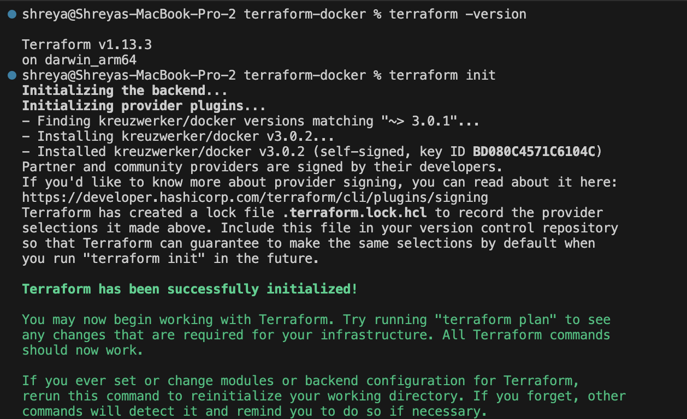
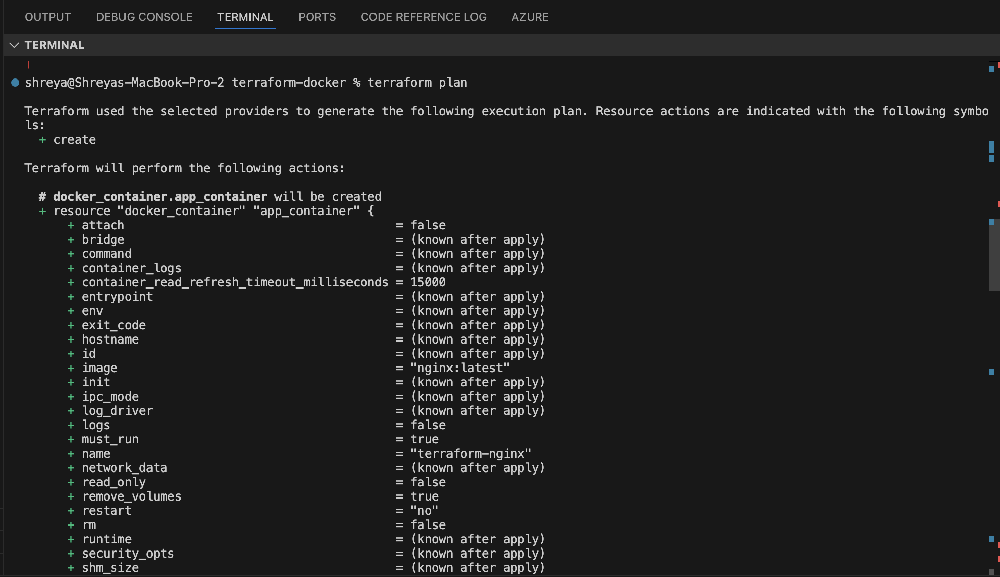
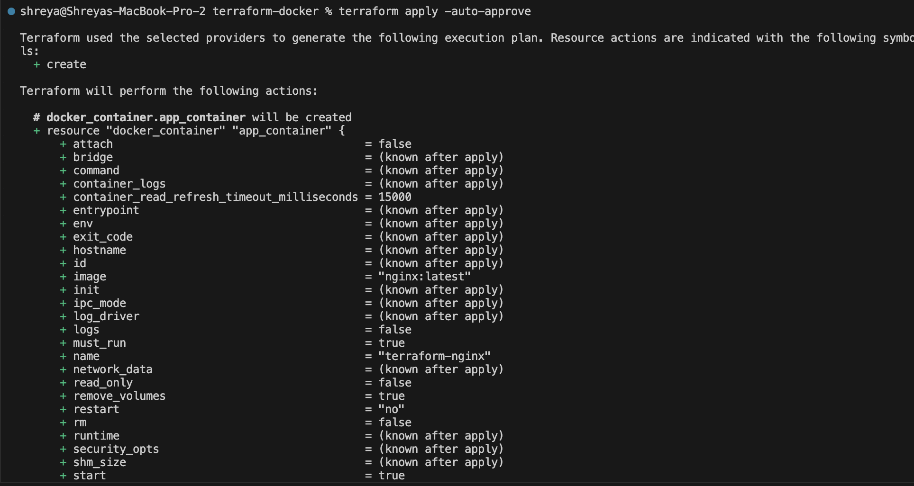
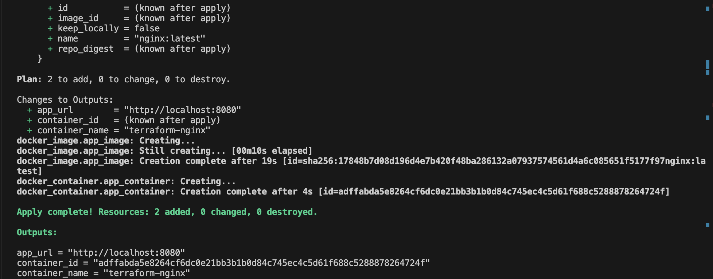
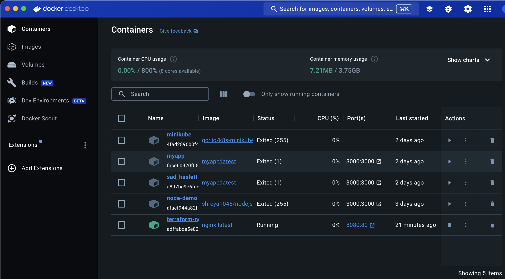
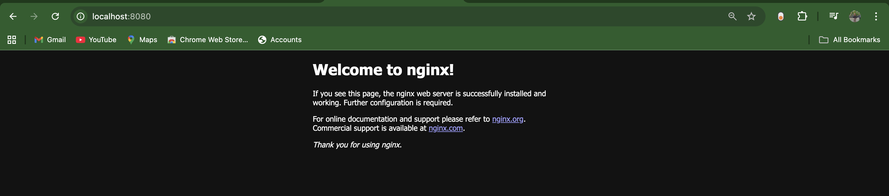
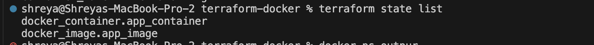
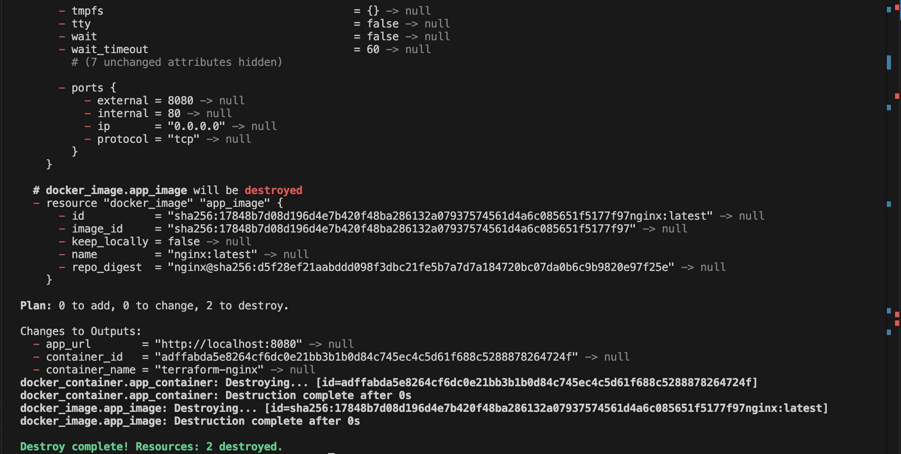

## 🚀 Terraform + Docker: Infrastructure as Code (IaC)
## 📌 Objective
Provision a local Docker container using Terraform to understand Infrastructure as Code (IaC) concepts.
## 🛠 Tools Used
1. Terraform
2. Docker
## 📂 Project Structure
```
terraform-docker/
├── main.tf        # Terraform config (Docker provider + resources)
├── variables.tf   # Variables for image, container name, ports
├── outputs.tf     # Outputs (container ID, name, URL)
├── .gitignore     # Ignore Terraform state & cache files
```
## ▶️ Steps to Run
1. Initialize Terraform
```
terraform init
```


2. Preview the Plan
```
terraform plan
```


3. Apply (Provision the Container)
```
terraform apply -auto-approve
```




Browser showing http://localhost:8080 (Nginx welcome page)


4. Check Terraform State
```
terraform state list
```


5. Destroy (Cleanup)
```
terraform destroy -auto-approve
```

## ✅ Outcome
1. Learned how to use Terraform Docker provider.
2. Successfully provisioned and destroyed an Nginx container using IaC.
3. Verified container state with Terraform commands and Docker CLI.
